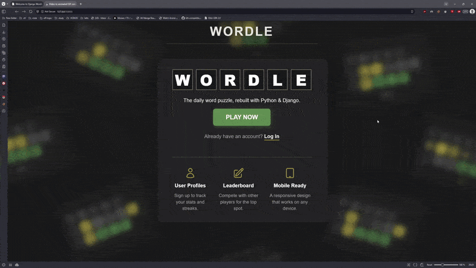

# Wordling

[](https://opensource.org/licenses/MIT)
[](https://www.python.org/downloads/)
[](https://www.djangoproject.com/)
[](https://www.django-rest-framework.org/)

A modern, full-featured implementation of the popular word-guessing game Wordle, built with Django. Features a polished animated web interface with glassmorphism effects, a comprehensive REST API, and a complete user account system for tracking statistics and competing on a global leaderboard.

---

## Demo

Check out Wordling in action:



---

## Key Features

- **Classic Wordle Gameplay**
  - Beautiful, responsive interface with smooth animations
  - Tile flip effects, win celebrations, and invalid guess feedback
  - Color-coded letter feedback (Green = correct position, Yellow = wrong position, Gray = not in word)
  - Support for duplicate letter handling

- **Highly Configurable**
  - All game rules configurable via environment variables
  - Customize word length, max guesses, animation timings, and UI dimensions
  - No code changes needed - just update `.env` file
  - Perfect for creating different difficulty modes

- **User Account System**
  - Complete registration and authentication flow
  - Persistent game statistics tracking
  - Win percentage and streak calculations
  - Guess distribution analytics

- **Competitive Leaderboard**
  - Public ranking system based on max streaks and win percentages
  - Real-time statistics display
  - Compare your performance with other players

- **REST API**
  - Game creation and management endpoints
  - Guess submission and validation
  - User profile data access

- **Modern UI/UX**
  - Glassmorphism design with frosted glass panels
  - Fully responsive layout for mobile and desktop
  - jQuery-powered interactivity
  - Clean, professional aesthetic

---

## Tech Stack

| Layer | Technology |
|-------|-----------|
| **Backend** | Python 3.10+, Django 5.2, Django REST Framework 3.16 |
| **Database** | SQLite (development), PostgreSQL-ready (production) |
| **Frontend** | HTML5, CSS3, JavaScript (ES6+), jQuery 3.7 |
| **Styling** | Custom CSS with Glassmorphism effects |
| **Word List** | [dwyl/english-words](https://github.com/dwyl/english-words) (~370k words) |

---

## Getting Started

### Prerequisites

Before you begin, ensure you have the following installed:
- **Python 3.10 or newer** ([Download here](https://www.python.org/downloads/))
- **pip** (Python package installer)
- **Git** (for cloning the repository)

### Installation & Setup

1.  **Clone the repository:**
    ```bash
    git clone https://github.com/NgTHung/Wordling.git
    cd Wordling
    ```

2. **Create and activate a virtual environment:**
   
   **On macOS/Linux:**
   ```bash
   python3 -m venv .venv
   source .venv/bin/activate
   ```
   
   **On Windows:**
   ```cmd
   python -m venv .venv
   .venv\Scripts\activate
   ```

3. **Install dependencies:**
   ```bash
   pip install -r requirements.txt
   ```

4. **Configure environment variables:**
   
   Copy the example environment file:
   ```bash
   cp .env.example .env
   ```
   
   Then edit `.env` with your preferred settings. See the [Environment Configuration](#environment-configuration) section below for details.

5. **Apply database migrations:**
   
   This will create the database schema and automatically load the word list from `words_alpha.txt`:
   ```bash
   python manage.py migrate
   ```

6. **Create a superuser (optional, for admin access):**
   ```bash
   python manage.py createsuperuser
   ```

7. **Run the development server:**
   ```bash
   python manage.py runserver
   ```

8. **Access the application:**
   - **Web Interface:** [http://localhost:8000/](http://localhost:8000/)
   - **API Root:** [http://localhost:8000/api/](http://localhost:8000/api/)
   - **Admin Panel:** [http://localhost:8000/admin/](http://localhost:8000/admin/) (requires superuser)

---

## Environment Configuration

Wordling uses environment variables to configure both Django settings and game parameters. This makes it easy to customize the game without modifying code.

### Setup

1. **Copy the example file:**
   ```bash
   cp .env.example .env
   ```

2. **Generate a secure secret key** (for production):
   ```bash
   python -c 'from django.core.management.utils import get_random_secret_key; print(get_random_secret_key())'
   ```

3. **Edit `.env`** with your preferred values.

### Configuration Options

#### Django Settings

| Variable | Default | Description |
|----------|---------|-------------|
| `SECRET_KEY` | (required) | Django secret key - **MUST be changed for production** |
| `DEBUG` | `True` | Enable debug mode - **MUST be False in production** |

#### Game Rules

Customize core gameplay mechanics:

| Variable | Default | Description |
|----------|---------|-------------|
| `GAME_WORD_LENGTH` | `5` | Number of letters in each word |
| `GAME_MAX_GUESSES` | `6` | Maximum number of guesses allowed |

**Example:** Create a harder mode with 6-letter words and only 5 guesses:
```bash
GAME_WORD_LENGTH=6
GAME_MAX_GUESSES=5
```

> **⚠️ Important:** When changing `GAME_WORD_LENGTH`, you must repopulate the word database:
> ```bash
> python manage.py migrate --fake api 0003_word_game_status
> python manage.py migrate
> ```
> This ensures only words of the correct length are loaded into the database.

#### Animation Timings (milliseconds)

Fine-tune the user experience by adjusting animation speeds:

| Variable | Default | Description |
|----------|---------|-------------|
| `ANIMATION_SHAKE_MS` | `600` | Duration of the "not enough letters" shake |
| `ANIMATION_TILE_FLIP_STAGGER_MS` | `350` | Delay between each tile flip |
| `ANIMATION_BOUNCE_STAGGER_MS` | `100` | Delay between each bounce on win |
| `ANIMATION_WIN_MODAL_DELAY_MS` | `1200` | Delay before showing the win modal |
| `ANIMATION_MODAL_DELAY_MS` | `200` | Delay before modal animates in |
| `ANIMATION_TOAST_TIMEOUT_MS` | `7000` | Auto-hide timeout for toast notifications |

**Example:** Faster animations for a snappier experience:
```bash
ANIMATION_TILE_FLIP_STAGGER_MS=200
ANIMATION_BOUNCE_STAGGER_MS=50
ANIMATION_WIN_MODAL_DELAY_MS=800
```

#### UI Dimensions

Control visual layout:

| Variable | Default | Description |
|----------|---------|-------------|
| `UI_TILE_GAP_PX` | `5` | Gap between tiles in pixels |
| `UI_BOARD_MAX_WIDTH_PX` | `350` | Maximum width of the game board |
| `UI_BOARD_COLUMNS` | `5` | Number of columns (should match `GAME_WORD_LENGTH`) |

#### Pagination

| Variable | Default | Description |
|----------|---------|-------------|
| `LEADERBOARD_PAGE_SIZE` | `50` | Number of players shown per leaderboard page |

### Example `.env` File

```bash
# Django Configuration
SECRET_KEY='your-super-secret-key-here'
DEBUG=True

# Game Rules
GAME_WORD_LENGTH=5
GAME_MAX_GUESSES=6

# Animation Timings (milliseconds)
ANIMATION_SHAKE_MS=600
ANIMATION_TILE_FLIP_STAGGER_MS=350
ANIMATION_BOUNCE_STAGGER_MS=100
ANIMATION_WIN_MODAL_DELAY_MS=1200
ANIMATION_MODAL_DELAY_MS=200
ANIMATION_TOAST_TIMEOUT_MS=7000

# UI Dimensions
UI_TILE_GAP_PX=5
UI_BOARD_MAX_WIDTH_PX=350
UI_BOARD_COLUMNS=5

# Pagination
LEADERBOARD_PAGE_SIZE=50
```

### Testing Different Configurations

You can easily test different game modes without changing code:

**Easy Mode (4 letters, 7 guesses):**
```bash
GAME_WORD_LENGTH=4
GAME_MAX_GUESSES=7
```

**Hard Mode (6 letters, 5 guesses):**
```bash
GAME_WORD_LENGTH=6
GAME_MAX_GUESSES=5
```

**Important:** After changing `GAME_WORD_LENGTH`, you must repopulate the word database:
```bash
python manage.py migrate --fake api 0003_word_game_status
python manage.py migrate
```

Then restart the development server:
```bash
python manage.py runserver
```

---

## API Documentation

The REST API provides programmatic access to all game functionality.

### Base URL
```
http://localhost:8000/api/
```

### Endpoints

| Endpoint | Methods | Authentication | Description |
|----------|---------|----------------|-------------|
| `/api/` | `GET` | None | API root with endpoint links |
| `/api/games/` | `GET`, `POST` | Session | List all games or create a new game |
| `/api/games/<id>/` | `GET`, `PATCH` | Session | Retrieve or update a specific game |
| `/api/guesses/` | `GET`, `POST` | Session | List guesses or submit a new guess |
| `/api/guesses/<id>/` | `GET` | Session | Retrieve a specific guess |
| `/api/users/` | `GET` | None | List all registered users |
| `/api/users/<id>/` | `GET` | None | Retrieve a specific user's profile |
| `/api/giveup/` | `GET` | Session | Forfeit current game and reveal the solution |

### Example API Requests

**Create a new game:**
```bash
curl -X POST http://localhost:8000/api/games/ \
  -H "Content-Type: application/json" \
  --cookie "sessionid=YOUR_SESSION_ID"
```

**Submit a guess:**
```bash
curl -X POST http://localhost:8000/api/guesses/ \
  -H "Content-Type: application/json" \
  -d '{"word": "hello"}' \
  --cookie "sessionid=YOUR_SESSION_ID"
```

**Response format for guess:**
```json
{
  "result": "GYBBB"
}
```
Where:
- `G` = Green (correct letter, correct position)
- `Y` = Yellow (correct letter, wrong position)
- `B` = Black/Gray (letter not in word)

---

## Project Structure

```
Wordling/
├── api/                      # REST API application
│   ├── models.py             # Game, Word, and Guess models
│   ├── serializers.py        # DRF serializers
│   ├── views.py              # API view classes
│   ├── urls.py               # API URL routing
│   ├── utils.py              # Helper functions (color_word logic)
│   ├── constants.py          # Game constants loaded from .env
│   └── words_alpha.txt       # Word list source file
│
├── wordle/                   # Main web application
│   ├── views.py              # Game, Home, and Leaderboard views
│   ├── urls.py               # Web URL routing
│   ├── static/
│   │   ├── css/              # Stylesheets with glassmorphism
│   │   ├── js/               # jQuery game logic
│   │   └── img/              # Images and assets
│   └── templates/
│       ├── base.html         # Base template with navbar
│       ├── game.html         # Main game interface
│       ├── home.html         # Landing page
│       └── leaderboard.html  # Player rankings
│
├── accounts/                 # User authentication & profiles
│   ├── models.py             # UserProfile model with stats
│   ├── views.py              # Login, Signup, Profile views
│   ├── urls.py               # Account URL routing
│   └── templates/
│       ├── login.html        # Login page
│       ├── signup.html       # Registration page
│       └── profile.html      # User statistics dashboard
│
├── Wordling/                 # Django project settings
│   ├── settings.py           # Main configuration file
│   ├── context_processors.py # Makes constants available in templates
│   ├── urls.py               # Root URL configuration
│   └── wsgi.py               # WSGI application entry point
│
├── .env                      # Environment variables (create from .env.example)
├── .env.example              # Example environment configuration
├── manage.py                 # Django management script
├── requirements.txt          # Python dependencies
├── pyproject.toml            # Project metadata
├── db.sqlite3                # SQLite database (generated)
└── README.md                 # This file
```

---

## How to Play

1. **Visit the homepage** and click "Play" or register for an account to track your stats
2. **Guess the 5-letter word** in 6 tries or fewer
3. **Observe the color feedback:**
   - 🟩 **Green** = Letter is in the word and in the correct position
   - 🟨 **Yellow** = Letter is in the word but in the wrong position
   - ⬜ **Gray** = Letter is not in the word at all
4. **Use the feedback** to make more informed guesses
5. **Win by guessing the word** before running out of attempts!

---

## Troubleshooting

### Common Issues

**Issue:** `ImportError: No module named 'rest_framework'`
- **Solution:** Make sure you've activated your virtual environment and run `pip install -r requirements.txt`

**Issue:** `ImproperlyConfigured: Set the SECRET_KEY environment variable`
- **Solution:** Create a `.env` file by copying `.env.example` and ensure it contains a `SECRET_KEY` value

**Issue:** Environment variables not being loaded
- **Solution:** 
  - Verify `.env` file exists in the project root (same directory as `manage.py`)
  - Check `.env` file format - no quotes around values unless they contain spaces
  - Restart the development server after changing `.env`

**Issue:** Database migration errors
- **Solution:** Delete `db.sqlite3` and rerun `python manage.py migrate`

**Issue:** Words not loading
- **Solution:** Ensure `api/words_alpha.txt` exists and run the migration `0004_Populate_words.py`

**Issue:** Changed `GAME_WORD_LENGTH` but wrong word lengths appear
- **Solution:** Rerun the word population migration to reload words with the correct length:
  ```bash
  python manage.py migrate --fake api 0003_word_game_status
  python manage.py migrate
  ```

**Issue:** CSRF verification failed
- **Solution:** Ensure cookies are enabled and you're using the same domain for API calls

---

## Contributing

Contributions are what make the open-source community such an amazing place to learn, inspire, and create. Any contributions you make are **greatly appreciated**!

### How to Contribute

1. **Fork the Project**
2. **Create your Feature Branch**
   ```bash
   git checkout -b feature/AmazingFeature
   ```
3. **Commit your Changes**
   ```bash
   git commit -m 'Add some AmazingFeature'
   ```
4. **Push to the Branch**
   ```bash
   git push origin feature/AmazingFeature
   ```
5. **Open a Pull Request**

### Contribution Guidelines

- Follow PEP 8 style guidelines for Python code
- Write descriptive commit messages
- Add tests for new features
- Update documentation as needed
- Ensure all tests pass before submitting PR

---

## License

This project is licensed under the MIT License - see the [LICENSE](LICENSE) file for details.

---

## Acknowledgments

- Word list provided by [dwyl/english-words](https://github.com/dwyl/english-words)
- Inspired by the original [Wordle](https://www.nytimes.com/games/wordle/index.html) by Josh Wardle
- Built with [Django](https://www.djangoproject.com/) and [Django REST Framework](https://www.django-rest-framework.org/)
- UI inspiration from modern glassmorphism design trends

---